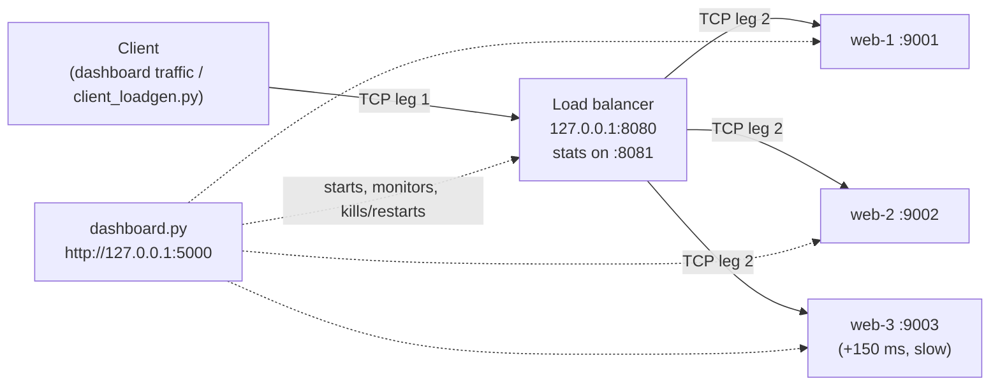

# TCP Load Balancer with Health Checks & Failover

A Layer-4 load balancer written from scratch with Python sockets. It spreads client connections across three backend servers, detects when one crashes, and routes around it. The client never sees an error. A live web dashboard lets you crash servers, switch algorithms and watch the traffic move. Every claim can be verified in Wireshark.


## Highlights

- **Real TCP, no frameworks.** Pure Python 3.8+ standard library (`socket`, `threading`), so there's nothing to `pip install`.
- **Three scheduling algorithms.** Round robin, least connections, and source-IP hash (sticky sessions).
- **Health checks.** An active TCP/HTTP probe every second marks a server DOWN after 2 failures and UP after 2 successes. A passive retry means a request that hits a just-crashed server is retried on another one.
- **Live dashboard.** Kill or restart servers, switch algorithms, generate traffic, run burst tests. It shows per-second charts, availability, throughput, latency and an event log. Works offline.
- **Wireshark-verifiable.** Every request is visible as two separate TCP connections (20 packets). A reference capture is included.

## Measured results

From one laptop: 3 backends, one deliberately slowed by 150 ms, 30 requests sent 5 at a time.

| Experiment | Result |
|---|---|
| Round robin | 10 / 10 / 10 split, 92 req/s, avg latency 53 ms |
| Least connections | Slow server got 3 of 30 requests, **189 req/s** (about 2× round robin) |
| Kill a server during live traffic | **29 / 29 requests succeeded (100% availability)** |
| Restart the killed server | Automatically back in rotation after 2 health checks (~2 s) |

Your numbers will vary slightly by machine.

## Architecture



The client only knows `127.0.0.1:8080`. For each connection, the balancer picks a healthy backend, opens its own TCP connection to it, and copies bytes both ways until either side closes.

## Quick start

Requires **Python 3.8+**. Nothing else.

```bash
git clone <your-repo-url>
cd tcp-load-balancer
python dashboard.py
```

This starts the three backends and the load balancer, then opens the dashboard at **http://127.0.0.1:5000**. On Windows you can double-click `start_dashboard_windows.bat` instead.

Stop everything with **Ctrl+C** in that terminal. Closing the window instead can leave the servers running in the background; see [Troubleshooting](#troubleshooting).

### Manual start (see each component's raw logs)

```bash
python backend_server.py --port 9001 --name web-1
python backend_server.py --port 9002 --name web-2
python backend_server.py --port 9003 --name web-3 --delay 150
python load_balancer.py --algo rr --interval 1
python client_loadgen.py -n 30 -c 5          # burst test
python client_loadgen.py --watch --gap 0.3   # continuous traffic, for the failover demo
```

On Windows, `start_demo_windows.bat` opens each of these in its own window.

## Demo script

1. `python dashboard.py`: all three servers show **UP**.
2. Turn on **Live traffic**: requests are shared across the servers on the chart.
3. Click **Kill process** on web-2. It turns **DOWN** within about a second, and **Failed requests stays 0**.
4. Click **Start process**. web-2 is back **UP** about 2 s later and receives traffic again.
5. Switch to **Least connections** and click **Run** on a burst test. The slow web-3 gets far fewer requests and throughput rises.
6. Switch to **Source-IP hash**. The *Latest connections* table shows each client IP always paired with the same backend.

## Verifying with Wireshark

- **Interface:** *Adapter for loopback traffic capture* on Windows (install Npcap with "Support loopback traffic"), or `lo` on Linux.
- **Capture filter:** `tcp port 8080 or tcp portrange 9001-9003`

| Display filter | What it shows |
|---|---|
| `tcp.port == 8080` | Client ↔ balancer: SYN, SYN-ACK, ACK, `GET` (35 B), `200 OK` (~153 B), FIN |
| `tcp.flags.syn == 1 && tcp.flags.ack == 0` | Two new connections per request, plus one per health probe |
| `http.request \|\| http.response` | The same GET on both legs (use *Decode As → HTTP* for ports 9001-9003) |
| `tcp.flags.reset == 1` | RSTs from a killed server's port: what the health check detects |
| `tcp.dstport == 9002 && tcp.len > 0` | In *Statistics → I/O Graph*: web-2's traffic drops to zero at the crash |
| `tcp.stream eq 0` | Right-click → *Follow → TCP Stream* to read one full exchange |

`captures/sample_capture_reference.pcap` holds a reference trace: 3 requests, web-2 killed, 3 more requests.

## Project structure

```
tcp-load-balancer/
├── backend_server.py            # tiny HTTP/1.0 server on raw TCP sockets (run 3 copies)
├── load_balancer.py             # the Layer-4 load balancer (:8080) + stats JSON (:8081)
├── client_loadgen.py            # CLI traffic generator: burst mode or --watch mode
├── dashboard.py                 # launcher + JSON API + serves the web frontend (:5000)
├── dashboard.html               # the frontend (vanilla JS/SVG, no external requests)
├── start_dashboard_windows.bat  # one-click dashboard launch
├── start_demo_windows.bat       # every component in its own window
├── captures/
│   └── sample_capture_reference.pcap
├── docs/
    └── dashboard.png

```

## How it works

| Piece | Mechanism |
|---|---|
| Accepting clients | `socket.bind()` + `listen()` on `127.0.0.1:8080`; one thread per connection |
| Choosing a backend | `rr`: rotate through the list · `least`: fewest active connections · `hash`: `CRC32(client IP) mod (healthy backends)` |
| Relaying | A second TCP connection to the backend; two threads copy bytes each way; `shutdown(SHUT_WR)` passes the FIN on |
| Active health check | Every `--interval` s: a TCP connect (or `GET /health` with `--check http`). DOWN after `--fall` failures, UP after `--rise` successes |
| Passive health check | If connecting to the chosen backend fails, mark it DOWN immediately and retry the next one |
| Stats | `GET http://127.0.0.1:8081/` returns per-backend state, connections and bytes as JSON |

### Load balancer options

```
python load_balancer.py --help
  --listen 127.0.0.1:8080       virtual IP:port clients connect to (use 0.0.0.0:8080 for other machines)
  --backends 127.0.0.1:9001,...  backend list
  --algo rr|least|hash           scheduling algorithm
  --check tcp|http               health check type
  --interval 2  --fall 2  --rise 2  --timeout 1
  --admin 127.0.0.1:8081         stats endpoint
```

## Troubleshooting

- **"Port(s) [...] are already in use"**: an earlier run is still going. In PowerShell:
  ```powershell
  Get-NetTCPConnection -LocalPort 5000,8080,8081,9001,9002,9003 -State Listen -ErrorAction SilentlyContinue | ForEach-Object { Stop-Process -Id $_.OwningProcess -Force }
  ```
  On Linux or macOS: `pkill -f backend_server.py; pkill -f load_balancer.py; pkill -f dashboard.py`
- **A dead backend takes about 1 s to fail over on Windows.** Windows retries a SYN twice after an RST, so the connect waits for `--timeout`. The request still succeeds.
- **Source-IP hash shows only one client on macOS.** macOS only allows binding to `127.0.0.1`, so the dashboard falls back to a single client.

## Limitations & future work

- The balancer itself is a single point of failure. Real deployments pair two balancers on a shared virtual IP (VRRP).
- Mod-N hashing reshuffles clients when the backend count changes. Consistent hashing would fix that.
- Backends see the balancer's IP, not the client's. The fix is an `X-Forwarded-For` header or the PROXY protocol.
- No TLS.

## Author

Sanyog Pardeshi · Roll No. 16010420581 · Division A · Batch A3
